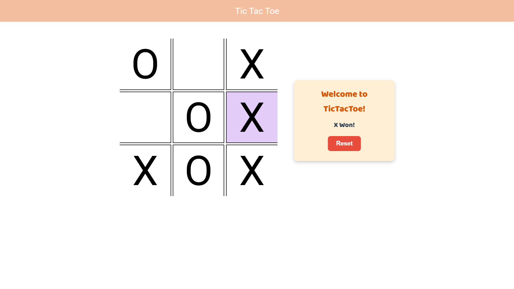
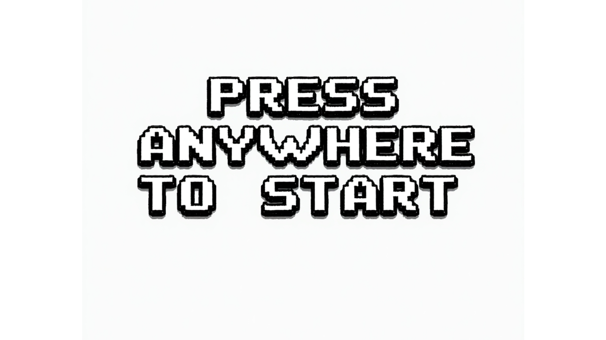
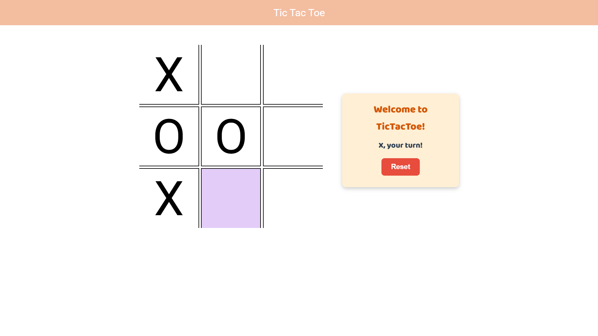

# 🎮 Tic Tac Toe - JavaScript Game

A simple **Tic Tac Toe** game built using **HTML, CSS, and JavaScript** with smooth animations and sound effects! 🎵


## 🔍 Preview
  


## 🕹️ How to Play

1. **Click** on any empty box to place your mark (**X or O**).
2. Players take turns marking the grid.
3. The first player to get **three marks in a row (horizontal, vertical, or diagonal) wins!**
4. If all boxes are filled and no one wins, it's a **draw**.
5. Click **Reset** to start a new game.

## 🎨 Features
✅ **Smooth animations** and hover effects 🎭  
✅ **Game Over animation** replaces the grid 🔥  
✅ **Background music & sound effects** 🎶  
✅ **Responsive design** (works on all devices) 📱💻  

## 🔧 Installation
1. Clone the repository:
   ```sh
   git clone https://github.com/YOUR_GITHUB_USERNAME/tic-tac-toe.git
   ```
2. Open `index.html` in your browser.

## 📸 Step-by-Step Guide (With Images)

1. **Game Start Screen**  
   

2. **Game in Progress**  
   

## 🛠️ Technologies Used
- **HTML5** - Structure 📜
- **CSS3** - Styling 🎨
- **JavaScript** - Game Logic 🧠

## 📜 License
This project is open-source. Feel free to modify and improve! 🎉

---
**Made with ❤️ by ArshLabs**

